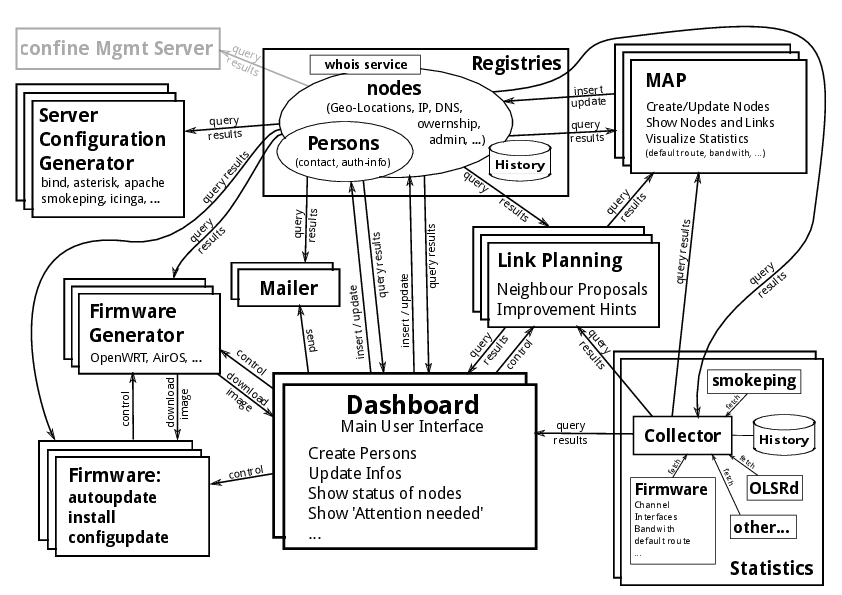

# Architecture and use-cases of the community wireless netowork operating system (CWNOS)
*Authors: L. Aaron Kaplan <aaron@lo-res.org>, Christian Pointner <equinox@chaos-at-home.org>*

## Status of this Memo

DRAFT!

## TODOs:

1. complete the document
2. describe other documents
3. make RFCish, use XML/RFC tools

## Copyright Notice

## Abstract

This document describes use-cases of the common nodeDB and its interactions with other components such as the map, linkplanning tools, monitoring tools, dashboard(s), an experiment management DB, firmware generator(s), etc.

## Table of Contents

TODO: Generate

## 1.  Introduction

Over the course of ten+ years of community wireless network development and research, different wireless community networks have come up with different node databases (nodeDB). These are essential for managing a network. In the most simplest case, these node databases are simply a list of assigned IP addresses or address ranges and nothing else.
In the most elaborate cases, these nodeDBs offer all kinds of features such as link planning.

The aim of this document is to describe a rather complete set of features which a nodeDB may implement. 

## 2. Definitions

### Node
  By node we denote a physical location where one or multiple devices are grouped together and are directly interconnected on layer 2.
  A node is not to be confused with a device. 
  
### NodeDB
  Strictly speaking, the nodeDB is the set of different registries (IP address, nodes and device registry and person registry). There are other components (as mentioned in the introduction) which interplay with the nodeDB. For example the map, the dashboard, etc. These components usually query the nodeDB via a REST interface.
  
### Device
  By device we mean an individual piece of  (router) hardware which is an independent participant in the mesh network.
  
### Dashboard
  By dashboard we denote the main user interface through which a user of the community wireless network can see "his" community wireless network. It also gives the user a comparison actual data of the network (statistics, reachability etc) with the stored data in the nodeDB

### Community Wireless Network (CWN)
XXX FIXME XXX

## Architecture description

### Registries

There are a few objects which need to be stored in a central registry in order to avoid inconsitencies and in order to keep it simple.
These registries do not have a user interface (maybe an admin interface) but they offer their services to *authenticated* clients via a RESTful API.

The registries are also reachable via a whois service (limited access to some IP ranges).

In the drawing (XXX refXXX) there is only one registry drawn. Most other modules can have multiple instances. 

### Node Registry

The node registry stores nodes as well as devices and the device's IP addresses.

### Person Registry

The person registry stores the information about community wireless network users: username, email address(es), authentication information, telephone numbers, the postal address, etc.
A person might have an avatar picture

XXX FIXME: document communication-marketplace/forum/agora. I have skills $foo, searching for skills $bla XXX

### Archive

The archive's role is to keep historical records of the person registry and the node registry.

### Dashboard

This is the main user interface for the CWNOS. A reference implementation
is the [CWNOS dashboard](http://github.com/FFM/dashboard).

### Mailer

The mailer's purpose is to inform users.

In order to fullfill it's job, it needs access to the person registry in order to figure out how that person can be contacted (mail, encrypted mail, twitter, IM, notification in the dashboard,...) and then contacts the user accordingly.
The mail offers an API interface to the dashboard(s):
  contact_user(user_id, priority, message)

### Map

The map is the primary tool by which users can :

* search for nodes / devices
* show link planning information (fresnell zone, ...)
* register nodes
* move nodes
* delete nodes
* show a node's links
* visualize statistics (bandwidth, default route, packet loss, ...)
* visualize minimum spanning trees and chosen path to the next default gateway

In order to fullfill it's tasks, the map needs to query data from the registries, the link planning tool and the statistics module. 
  
There are two modes of operation for a map depending on the fact if users are logged in or not.
If a user is logged in, the map will display detailled information (including contact information of the potential link partners). If a user is not logged in, he or she will only see approximate information and in no case personal information (such as telephone numbers etc) of other users.
BETTER ALTERNATIVE: users should be able to say which info can be shown on the dashboard and which information should never be shown.

The map should be integratable into the dashboard but also run as a stand-alone (web based) application.

 
### Link Planning 

### Statistics

### Autoupdate & Installer

### Firmware Generator

### Server Configuration Generator

## Use Cases

### 0. Permission system

### I. Registry

#### 3. Register new user

* Assign user to (geographic) network
* Change user
* Unregister/delete user
* Register/Change/Delete super*-admin
* Assign/Change/Delete mentor
* Change permissions user

#### 4. Register new node

* Assign node to (geographic) network
* Change node, change node's location
* Unregister/delete node
* Change admin-c (ownership)
* Change tech-c
* Upload/Change/Delete panorama views

#### 5. Register device

* Change device, change device's node, change devices' location
* Assign device to (routing) network
* Unregister/delete device
* Change admin-c (ownership)
* Change tech-c
* Change device into a gateway
* Change state of device (new, planned, under construction, online, maintenance mode)

#### 6. Register network

* Assign DNS suffix to network
* Change network
* Move nodes to network
* Hand over network to new admin/super*-admin
* Delete network

#### 7. Add/change/delete ressources and basic data

(IPs, permission types, netblocks, voip#, DNS suffixes, link types (fiber, copper, wireless), ...)
Basic data: Antenna types, Device Types, Suppliers, Wireless channels, Wireless mode, 
Import / Export basic data. For example a new device type is being worked on in one network and the specs are added to a nodeDB. Then the other nodeDBs are informed that this device type is supported and they get the basic data for it (number of interfaces, name, model, amount of RAM, etc)

#### 8. Register IP addresses / address block

* Unregister IP addresses
* Assign authoritative DNS server to address block

#### 9. Reclaim IP addresses

* Teardown period...

#### 10. Renumbering of IPs

#### 11. Register link
PPA agreement mails to link partners, do you want to have a link to each other? please confirm ("link/neighbor request")
Keep history of link: did it work? When was it planned? When established? Did it change link partners? ...
Say "this is an important link for me, please inform me (the link partner or the super-admin), if it is down".  -> register in monitoring system for warnings

### Link planning

Get recommendations, which other link partners might see your own node (click on panorama views of related nodes)

Search for potential link partners: get side view of fresnell zone.

### Provisioning

#### 1. CPE provisionin

* Choose device from list of devices and manufacturers (show picture!)
* Press "generate firmware"
* Get informed when firmware is finished

Another approach: we hand out a standard firmware which only knows how to connect to other mesh nodes. Upon connecting, it will post it's mac address to the server. The server knows which device this is because the mac address was already registered and sends the client the complete configuration. The device reboots, connects back to the server and the server marks the device as online and correctly configured.

#### 2. Server config provisioning

* generate smokeping configuration files
* generate nagios/monitoring system configuration files
* generate DNS zone files
* generate network map (see cronjob admin tasks)

### cronjob admin tasks

The common node DB must have the following use-cases in mind: it should be easy to access the necessary information so that a periodic job can:

* fetch routing topology graph, give it a timestamp and store it for analysis
* generate network topology graphs

### Map

The map is the primary graphic user interface for registering and administering nodes.

### Node admin's dashboard
The dashboard is the personal view of the community mesh network as seen through the eyes of a node owner/device owner (and/or tech-c). 

NOTE: the dashboard is *not* part of the common node DB. It is specified separately in . The dashboard can run in a distributed fashion with individual parts of the network covered by different dashboards.

The common node DB must have the following use-cases in mind (and provide the necessary data for those via ReSTful interfaces): 
the owner and/or tech-c of a node/device should be able to log into a dashboard and see all the tasks which need to be done for his/her node and/or devices.
In addition, each task should be able to have some configurable reminders ("alarms").
It should be possible to:

* send out reminders to users, about missing info (panorama view uploads, missing tel# ,...)
* send out reminders to users to update outdated information, 
* send reminders to users that this is the data that we have about them and if it is still current
* IP reclaim mails: these IPs have not been in use for X months. Send out a reminder to users that these IPs will be reclaimed automatically if not in use until some day
* inform users which still have devices with outdated firmware versions about updates if no auto update 
* get a list of nodes where automatic updates are allowed
* send out reminders of security updates
* present security vulnerabilities which were discovered somehow by some means and present security advice and reminders
* "newsboard": present updates for the status of the whole network or for the section of the network which is 
* a node owner can select via nodeDB which dashboard he wants to use. The node owner then gets a token code which needs to be entered in the other dashboard, which in turn gets permissions to read data from the nodeDB.
* the dashboard should compare the current state of data of a node and its' data as stored in the nodeDB. If there are dif
  
  
  XXXXXXX 
  statistics node
  

## Acknowledgments
This document would not have been possible without the contribution of numerous people: 
 Michael Bauer for wisdom, Mitar's relentless stream of opinions and ideas, Amir Sagie for discussing with Aaron many times how nodeDBs should be structured, 
 ...

## References

